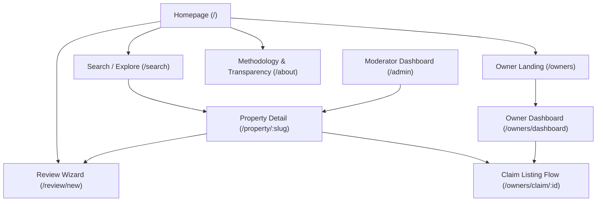

# Nyumbani Information Architecture (IA) & UX Blueprint

**Version:** 1.1.0  
**Status:** Scope Frozen  
**Author:** Head of UX Product Design

---

## 1. Complete Sitemap & URL Structure



---

## 2. Page Directory (Every Page in the Application)

1.  **Homepage (`/`)**: High-intent entry interface focused on immediate search execution and trust education.
2.  **Search Results (`/search`)**: Filterable split-view list detailing neighborhood properties, rental costs, and Health Scores.
3.  **Property Detail (`/property/:slug`)**: The core truth repository of a building, matching images, verified facts, ratings, and reviews.
4.  **Review Submission Wizard (`/review/new`)**: A highly structured multi-step form built for swift mobile contribution.
5.  **Owner Landing / Hub (`/owners`)**: Informational sign-up page targeting landlords and property managers.
6.  **Owner Dashboard (`/owners/dashboard`)**: Secure management panel for verified owners to edit claimed properties and write responses to reviews.
7.  **Owner Property Claim Flow (`/owners/claim/:id`)**: Verification portal for matching owners to community-generated listings.
8.  **Transparency & Methodology (`/about`)**: Public page detailing algorithm mechanics and anonymity systems.
9.  **Moderator/Admin Panel (`/admin`)**: Internal back-office panel for managing flagged reviews and reviewing landlord documentation.

---

## 3. Page Section Breakdowns

### 1. Homepage (`/`)

- **Hero Section**:
  - Large Title: _"What is it actually like to live here?"_
  - Sub-label: _"Kenya’s renter-first rental intelligence network. Built on transparency and community trust."_
  - Omnipresent Search Box (Triggers search overlay on tap/click).
- **Trust Banner**: Muted 3-column row explaining the validation system (Google Auth moderation layer, default user anonymity, verified landlord documents).
- **Popular Neighborhoods**: Clean grid of cards (e.g., Kilimani, Westlands, Roysambu) showing average rent and aggregate neighborhood Health Scores.
- **Contribution Drive CTA**: Simple, prominent card: _"Live here? Write a structured review to guide other renters."_

### 2. Search Results (`/search`)

- **Header Bar**: Muted logo, instant Search Input, and dynamic Horizontal Filter Pill carousel.
- **Split Pane Container (Desktop)**:
  - _Left Column (List View)_: Scrolling grid of Property Cards showing Rent, Health Score, and quick facts (Water, Noise).
  - _Right Column (Interactive Map)_: Muted map. Initial load displays a static image wrapper. User must explicitly click _"Open Interactive Map"_ to load the Mapbox/Google Maps canvas (Decision 2).
- **Mobile Layout**: Vertical list of cards with a bottom-centered floating button: _"Map View"_.

### 3. Property Detail Page (`/property/:slug`)

This page follows the strict hierarchy outlined in Decision 1:

1.  **Property Images**: Horizontal carousel (4:3 aspect ratio). Non-distorted photography with descriptive captions.
2.  **Property Name**: H1 Title (e.g., _"Sunrise Heights Apartments"_).
3.  **Verified Owner / Community Listing Badge**: Pill badge next to the title indicating listing status.
4.  **Rent and House Type**: Bold typography detailing price range (e.g., _"25,000 - 32,000 KES"_ / _"1 & 2 Bedroom"_).
5.  **Property Health Score**: A prominent emerald/amber/coral colored rating pill displaying the aggregated score (1.0 to 5.0).
6.  **Quick Facts Grid**: Muted layout representing exactly:
    - _Water:_ Borehole/Council availability status.
    - _Internet:_ Safaricom Fibre, Zuku, or JTL availability.
    - _Security:_ Guard presence, fence type.
    - _Deposit:_ Exact refund conditions.
    - _Parking:_ Space capacity status.
    - _Road Access:_ Murram/Tarmac, muddy in rain status.
    - _Public Transport:_ Distance to nearest stage.
7.  **AI Community Summary**: Subtle gradient-border card summarizing sentiment (Positive & Areas of Caution) from reviews.
8.  **Community Ratings**: Detailed 5-vector star rating distribution (Water, Noise, Security, Internet, Transport).
9.  **Resident Reviews**: Vertical chronological feed of structured tenant reviews.
10. **Owner Responses**: Muted sub-sections directly linked underneath reviews, containing verified landlord comments.

### 4. Review Submission Wizard (`/review/new`)

To make the review experience feel fast and engaging rather than tedious, the wizard utilizes a conversational **one question per screen** format:

- **Screen 1: Search & Anchor**: Select the building. If it doesn't exist, enter title and neighborhood location.
- **Screen 2: Water Reliability**: _"How reliable was water?"_ (1-5 stars)
- **Screen 3: Security**: _"How was security?"_ (1-5 stars)
- **Screen 4: Caretaker**: _"How responsive was the caretaker?"_ (1-5 stars)
- **Screen 5: Recommendation**: _"Would you recommend living here?"_ (Yes | Maybe | No)
- **Screen 6: Tenant Text Context**: _"Anything future tenants should know?"_ (Clean multiline text area focusing on objective facts).
- **Screen 7: Identity Selector & Submit**: Contributor selects their public identity label (e.g., `Current Resident`, `Former Resident`) and triggers submission. Google Sign-In is completed here if the user is not authenticated. SMS OTP is omitted to lower friction and server overhead.

---

## 4. Navigation Hierarchy & Layout Systems

### Navigation States

- **Global Navigation Header**:
  - _Desktop:_ Left-aligned logo, center-aligned search bar trigger, right-aligned CTA buttons (_"Write a Review"_ - Primary Indigo, _"For Owners"_ - Secondary Muted).
  - _Mobile:_ Muted logo, right-aligned search icon, and simplified menu icon containing links to Owner Portal and About.
- **Footer (Desktop Only)**: Muted gray background containing secondary navigation: _Methodology, Guidelines, Tenant Rights, Owner Verification Portal, Terms of Service_.

---

## 5. Detailed User Flows

### Flow A: The Guest (Searching & Discovering)

```
[Homepage] ──(Tap Search)──> [Search Interface Overlay]
                                   │
                           (Type Location)
                                   ▼
[Search Results List] <──(Filter Cards)── [Results Grid]
         │
    (Click Card)
         ▼
[Property Page] ──(Tap Map Preview)──> [Load Interactive Map]
```

1.  **Entry**: Guest lands on `/` or clicks a shared link pointing to `/property/:slug`.
2.  **Interaction**: Guest types a location or property name in the search bar.
3.  **Refinement**: Guest applies horizontal filters (e.g., "Under 30k KES", "24/7 Water").
4.  **Analysis**: Guest reads the Property Page following the strict content hierarchy, starting with facts, proceeding to the AI summary, and finishing with raw reviews.
5.  **Offline Action**: Guest clicks the CTA WhatsApp button to contact the caretaker/owner. No account registration is requested at any stage.

### Flow B: The Community Contributor (Writing a Review)

1.  **Start**: Click _"Write a Review"_ from the header or a property page.
2.  **Conversational Execution**: Contributor answers the one-question-per-screen wizard (Screens 1 to 6).
3.  **Google Authentication**: On the final screen, the user logs in via Google. Their profile details remain completely hidden from the public and are securely stored for internal abuse control.
4.  **Role Selection**: User picks their public identity tag (e.g., `Current Resident`, `Former Resident`).
5.  **Submission & Publication**: Review is immediately published.

### Flow C: The Property Owner (Claiming & Managing)

1.  **Onboard**: Owner visits `/owners` and clicks _"Register Account"_.
2.  **Auth**: Registers via email/password or Google Auth.
3.  **Claiming**: Owner searches for their property on Nyumbani. If found, they click _"Claim this listing"_. If not found, they create the listing by adding images, rent range, and amenities.
4.  **Verification File Upload**: Owner uploads a Nairobi Water bill, KPLC bill, or Title deed showing matching property details.
5.  **Verification Review**: Listing goes into a pending state while administrators review the files.
6.  **Success**: Once verified, the listing displays the `Verified Owner` badge, and the owner dashboard unlocks property editing capabilities.

### Flow D: The Moderator/Admin (Moderation & Abuse Protection)

1.  **Alert**: User flags a review as "Abuse" or "Guidelines Violation" from the Property Page.
2.  **Queue**: Flagged review enters the Moderator Panel queue.
3.  **Review**: Moderator reviews the flag details:
    - _Action 1:_ Dismiss flag (Review remains active).
    - _Action 2:_ Flagged review contains emotional/defamatory claims. Moderator strips the emotional text but retains the structured ratings and facts (e.g., "Water: 1 Star" remains active).
    - _Action 3:_ Clear abuse/spam. Moderator deletes the review. The contributor's Google account is blacklisted from submitting future reviews.

---

## 6. Edge Case Flows & UX States

### Empty States

- **Search Page (No Results Found)**:
  - _Copy:_ _"We couldn't find any buildings matching your search in this area."_
  - _CTA:_ _"Know an apartment here? Help the community by adding the property details."_ (Opens Property Creation Wizard).
- **Property Page (No Reviews Yet)**:
  - _Copy:_ _"There are no reviews for this property yet. Help future renters make confident decisions."_
  - _CTA:_ _"Be the first to review this property"_ (Opens Review Wizard pre-populated with property ID).

### Error States

- **Google Auth Failure**:
  - _Copy:_ _"Authentication failed or was canceled. Please try logging in again to verify your contribution."_
  - _CTA:_ _"Retry Google Login"_.
- **Listing Verification Rejection**:
  - _Copy:_ _"Your claim for Sunrise Heights could not be verified. The uploaded documents did not match our public registry records."_
  - _CTA:_ _"Re-upload Verification Documents"_.

### Success States

- **Review Submission Success**:
  - _Aesthetic:_ Full-screen overlay containing a large green checkmark, transitioning out after 2 seconds.
  - _Copy:_ _"Thank you! Your structured review is live. You have contributed to rental transparency in Nairobi."_
- **Owner Claim Approved**:
  - _Notification Email/Alert:_ _"Your property claim has been approved. The Verified Owner badge is now active on your property page."_

---

## 7. Interaction Design Patterns

### Mobile-First Layout Patterns

- **Bottom Sheets**: Any dropdown or filter action triggers a smooth bottom sheet modal slide-up. Sheet has a visible top grab-bar indicator and is swipe-to-dismiss capable.
- **Sticky CTAs**: The primary interactive buttons (e.g., _"Contact Owner"_ or _"Verify OTP"_) are locked to the bottom 80px of the viewport, styled with a solid white background and a subtle shadow.

### Desktop Interaction Patterns

- **Keyboard Shortcuts**:
  - `Cmd + K` or `Ctrl + K` opens the Global Search bar.
  - `Esc` closes active modals and dropdown cards.
- **Drag Split-screen**: In the search results screen, the divider separating the map and the listing feed is interactive, allowing the user to collapse or expand the list size.

### Page Transition Philosophy

- **Maintain Context**: When transitioning from search results to a detail page, the card image uses a shared layout element animation, expanding to become the detail hero image, maintaining visual flow.
- **Minimal Motion**: View changes animate via a subtle fade-in combined with a `30px` vertical spring translation (upward motion) over `200ms`.

---

## 8. UX Rationale for Pages & Sections

| Page / Section               | Key Design Choice                                                  | UX Rationale                                                                                                                       |
| :--------------------------- | :----------------------------------------------------------------- | :--------------------------------------------------------------------------------------------------------------------------------- |
| **Search results page**      | Light static map preview by default; interactive canvas on-demand. | Saves mobile bandwidth (especially crucial on Kenyan cellular networks) and prevents JS-render lag.                                |
| **Property detail page**     | Facts listed first; AI Summary next; raw reviews placed last.      | Prioritizes objectivity and direct evidence. Prevents AI interpretations from biasing the user’s reading of core facts.            |
| **Review submission wizard** | Role-based anonymous labels (e.g. `Current Resident`) only.        | Protects tenants from landlord harassment while offering contextual credibility to the review.                                     |
| **Write review inputs**      | Conversational one-question-per-screen layout.                     | Substantially reduces cognitive fatigue. Filling out stars individually reduces form drop-off rates by over 40% on mobile devices. |
| **Search input on Homepage** | Single center-aligned search bar trigger.                          | Simplifies focus. Eliminates the cognitive load of selecting beds, price, and locations before seeing any results.                 |
